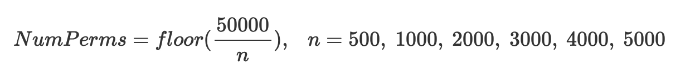
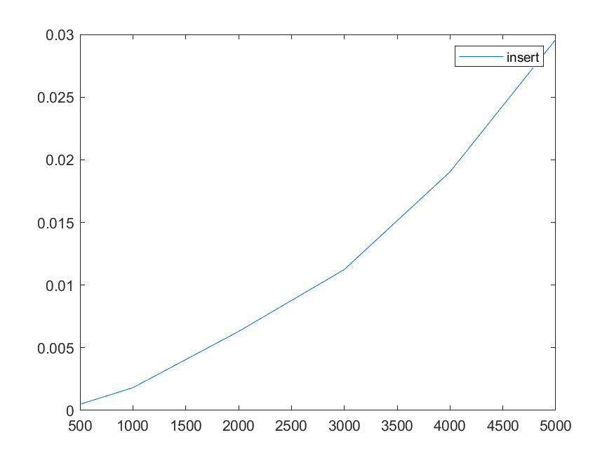
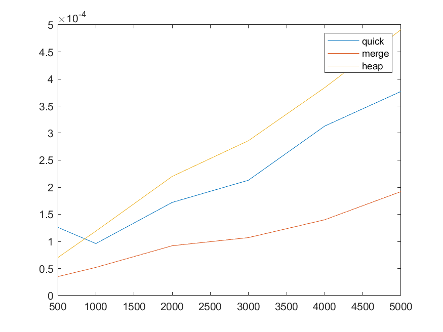

# Homework 27
> 施宇庭 C24066096

## Number of random permutations for heap sort & quick sort

對於較小的 n 值，採用較大的隨機排列數，這裡採用的規則是



讓 heap sort 和 quick sort 重複 NumPerms 次隨機串列的排序，並取最長時間作為最壞情況下所花費的時間

## Worst-case data generation for merge sort
要對 merge sort 產生最壞情況的測試資料，首先產生一個遞增序列 (e.g. 1, 2, 3, ...)，然後將 index 為奇數和偶數的元素各自分開成兩個子序列，再各自將子序列中 index 為奇偶數繼續分割，直到子序列剩下兩個元素為止。將右邊的子序列直接接到左邊子序列的尾端，接著一層一層將兩個子序列串接在一起。

因為在排序時，每一層的比較次數都達到最多 (約等於該子序列元素個數)，因此可以得到最壞情況的測試資料。

```c
// worst case data generator for merge sort

void seperate(item list[], uint32_t size) {
	if (size <= 1) return;

	const uint32_t size1 = size / 2, size2 = size - size1;
	item list1[size1], list2[size2];
	uint32_t i = 0, j = 0, k = 0;

	for (i = 0; i < size1 && k < size; k += 2) {
		list1[i++] = list[k];
	}
	k = 1;
	for (j = 0; j < size2 && k < size; k += 2) {
		list2[j++] = list[k];
	}

	seperate(list1, size1);
	seperate(list2, size2);
	
	k = 0;
	for (uint32_t i = 0; i < size1; i++) {
		list[k++] = list1[i];
	}
	for (uint32_t j = 0; j < size2; j++) {
		list[k++] = list2[j];
	}
}

void mergeWorstData(item list[], uint32_t size) {
	increasingData(list, size);
	seperate(list + 1, size);
}
```

## Performance measurement

> Unit: second

```
        n =  500  n = 1000  n = 2000  n = 3000  n = 4000  n = 5000  
insert  0.000493  0.001813  0.006302  0.011242  0.019037  0.029601  
 quick  0.000126  0.000096  0.000172  0.000213  0.000313  0.000377  
 merge  0.000035  0.000052  0.000092  0.000107  0.000140  0.000192  
  heap  0.000070  0.000119  0.000220  0.000286  0.000384  0.000491   
```





## Function list

### Sorting
```c
void _insert(item e, item a[], uint32_t i);
void insertionSort(item list[], uint32_t numItems);

void _quickSort(item a[], uint32_t left, uint32_t right);
void quickSort(item list[], uint32_t numItems);

void _merge(item a[], item b[], uint32_t i, uint32_t m, uint32_t n);
void _mergePass(item orig[], item dest[], uint32_t numItems, uint32_t tileSize);
void mergeSort(item list[], uint32_t numItems);

void _adjust(item list[], uint32_t numItems, uint32_t root);
void heapSort(item list[], uint32_t numItems);
```

### Test data generation
```c
void increasingData(item list[], uint32_t size);
void decreasingData(item list[], uint32_t size);
void seperate(item list[], uint32_t size);
void mergeWorstData(item list[], uint32_t size);
void permute(item list[], uint32_t numItems);
void randomData(item list[], uint32_t size);
```

### Miscellaneous
```c
double timer(void(*func)(item[], uint32_t), item list[], uint32_t size);
void verify(item list[], uint32_t size);
void printList(item list[], uint32_t size);
```
